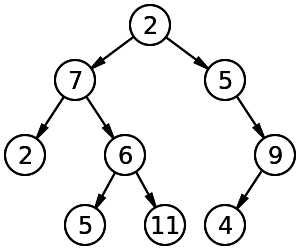
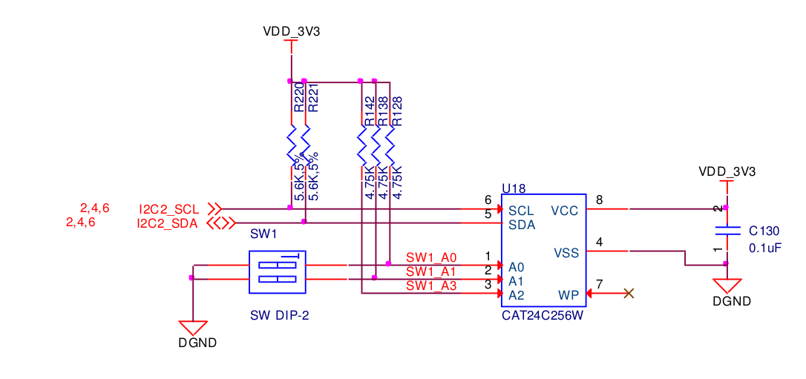

If your BeagleBone Black (BBB) project looks like a rats nest of
jumper wires, it may be time to turn your design into a cape.  Capes
are the equivalent to *shields* on other platforms and in this
tutorial, I will walk you through the unique aspects of BBB cape
development, namely how to set-up the cape EEPROM and working with the
device tree.

Cape Overview
-------------

The essential reference for designing capes is the BBB
[System Reference Manual (SRM)](https://github.com/CircuitCo/BeagleBone-Black/blob/master/BBB_SRM.pdf?raw=true).
The SRM explains that the BBB can support up to four capes.  Each cape
is required to have an Electrically Erasable Programmable Read-Only
Memory (EEPROM) which contains cape-specific information like the
board manufacture, revision, and pin usage.  The EEPROM must be
accessible via the Inter-Integrated Circuit (I2C) bus.  Devices on the
I2C bus have address and the four allowed BBB cape addresses are
`0x54 - 0x57`.  For more details about I2C on the BBB, check out my
[blog post](http://datko.net/2013/11/03/bbb_i2c/).

Device Tree Overview
-----------

If you hang around the official BeagleBoard.org
[forums](https://groups.google.com/forum/#!forum/beagleboard), which
is the best place for support, one more frequent topics of discussion.
The device tree was introduced in the 3.8 kernel as a new data
structure for describing hardware.  In computer science, a *tree* is a
structure that contains a node with zero or more edges (links) to
child nodes.  The Device Tree is sometimes referred to as a *Flattened
Device Tree*, which is the textual representation of the tree data
structure.  The following illustration shows an example tree data
structure.

What's so great about the Device Tree anyway?  Well, coupled with the
BBB Cape Manager (capemgr), the compiled device tree structure, the
*device tree overlay* can be loaded dynamically at run-time to
load the configuration into the kernel!  This is really nice if you
making a cape since you need only distribute your overlay for users to
use your cape.  What's nicer is that on boot, the BBB will
automatically read your cape's EEPROM and then load your device tree
overlay.  I'll cover this later on in this tutorial.  An excellent
reference on the device tree for the BBB is over at
[eLinux](http://elinux.org/BeagleBone_and_the_3.8_Kernel) and if you
prefer a video, the YouTube
[video](https://www.youtube.com/watch?v=wui_wU1AeQc) by Derek Molloy
is well worth your time.

Breadboarding the EEPROM
---------

Let's start playing with hardware.  To start, we are simply going to
connect an EEPROM to a breadboard and write a very basic configuration
to the EEPROM.  This example is based off the great work from
[Community Papermint Designs](http://papermint-designs.com/community/taxonomy/term/68).
Section 8.2 of the SRM illustrates the proper way to connect the
EEPROM without write protection.

Notice the DIP switches.  Remember that the BBB only supports four
capes.  How is each cape manufacture to ensure that his or her cape
doesn't use the same address as another?  Hence the configurable DIP
switches; these allow the EEPROM address to be changed.  However, for
you first foray into BBB capes, we are going to simply the circuit and
use a fixed address.  While this will work for prototyping, a
production cape will want to mirror the examples in the BBB SRM.

If you are using the EEPROM from
[SparkFun](https://www.sparkfun.com/products/525), you can wire the
EEPROM per the following example.

Breadboarding the EEPROM is straightforward, with pins `P9_2` supply
ground to the EEPROM's VSS pin, pin `P9_4` supplying 3.3V, `P9_19` is
the I2C-1 SCL line, and `P9_20` is the I2C SDA line.  The default
address for this EEPROM is `0x50`, which is outside the allowed I2C
address for Cape EEPROMs To change the EEPROM's address to `0x54`,
wire pin A2 (pin 3) to Vcc.

Generating the EEPROM Configuration
----

For the rest of this tutorial, I will assume that the cape exposes
serial UARTS, specifically UART4 from the BBB.  The Transmit (TX) Pin
is pin `P9_13` and the receive pin is `P9_11` on the BBB.  Serial data
is useful in the case you want to communicate
[between two BeagleBones](http://hipstercircuits.com/enable-serialuarttty-on-beaglebone-black/)
or if you want to
[flash an AtMega328p from your BeagleBone Black](http://datko.net/2013/11/11/bbb_atmega328p/).
However, confusingly, UART4 in the BBB SRM is known as UART5 in our
device tree overlay...

To generate the cape EEPROM configuration we will use the
[Cape EEPROM Generator](https://github.com/picoflamingo/BBCape_EEPROM)
by David Oliveira.  Clone the repo and type `make` to build the
executable, `bbcape_eeprom`.  The program is menu driven and allows
you to create the EEPROM data.  Press `b` to enter your board info:

    debian@arm:~/repos/BBCape_EEPROM$ ./bbcape_eeprom
    BeagleBone Cape EEProm Generator 0.2
    (c) 2013, David Martinez Oliveira
    License GPLv3+: GNU GPL version 3 or later <http://gnu.org/licenses/gpl.html>
    This is free software: you are free to change and redistribute it.
    There is NO WARRANTY, to the extent permitted by law.

    Press ? for help

    BBCapeEEPROM-TOP> b
    + Editing board info
    1. Cape Name (32 bytes)         : BeagleBone NULLCape
    2. Cape Version (4 bytes)       : 00A0
    3. Cape Manufacturer (16 bytes) : picoFlamingo
    4. Part Number (16 bytes)       : BB-NULLCape
    5. Serial Number  (12 bytes)    : 2912WTHR0383

The cape name and version fields are important because the BeagleBone
capemgr will attempt to load the device tree overlay file based on
those names, if not explicitly set in
`arch/arm/boot/dts/am335x-bone-common.dtsi`.  The SRM states that the
serial number should be `WWYY&&&&nnnn` where WW = 2 digit week of the
year of production, YY = 2 digit year of production, &&&& is a
manufacture specific assembly code, and nnnn = incriminating board
number from that week of production.

If you read the SRM, you'll see instructions for setting the pin
configuration in the EEPROM.  Currently, the capemgr loads the DTS
file for this information, but according to some helpful souls on the
BeagleBone freenode IRC channel (`#beagle`), the ultimate intention
was to load the pin configuration directly from the EEPROM without
needing the dts file.  We can skip the pin configuration for the
moment.

Write the EEPROM to a file using the 'w' command and specify a file
name.

Programming the EEPROM
-----------

With an EEPROM file now in hand, it's time to write the data to the
device.

If you reboot the BBB, the EEPROM will instantiate automatically
because the address is in the correct position.  Otherwise,
instantiate it as follows (as root):

`echo 24c256 0x54 > /sys/bus/i2c/devices/i2c-1/new_device`

With the `hexdump` we can verify the EEPROM is blank with:

    root@arm:/home/debian# cat /sys/bus/i2c/devices/1-0054/eeprom | hexdump -C
    00000000  ff ff ff ff ff ff ff ff  ff ff ff ff ff ff ff ff  |................|
    *
    00008000

Write the file to the EEPROM with the following command:

    cat cape.bin > /sys/bus/i2c/devices/1-0054/eeprom

Run the `echo` command shown previously to verify your EEPROM.

Preparing the Device Tree
-----

The following example will enable serial UART4 on the BBB:

This tutorial will walk through building the CryptoCape EEPROM.  Per
the
[BeagleBone System Reference Manual](https://github.com/CircuitCo/BeagleBone-Black/blob/master/BBB_SRM.pdf?raw=true),
a cape is required to have an EEPROM to store the pin configurations
needed for the cape.  The configuration is custom to each cape, but an
excellent starting tutorial is on the
[Community Papermint Designs](http://papermint-designs.com/community/taxonomy/term/68)
site.  For this tutorial, you'll need a
[BeagleBone Black](https://www.sparkfun.com/products/12076),
[EEPROM](https://www.sparkfun.com/products/525), and some hookup or
jumper wires.

/*
 * Copyright (C) 2012 Texas Instruments Incorporated - http://www.ti.com/
 *
 * This program is free software; you can redistribute it and/or modify
 * it under the terms of the GNU General Public License version 2 as
 * published by the Free Software Foundation.
 */
/dts-v1/;
/plugin/;

/ {
    compatible = "ti,beaglebone", "ti,beaglebone-black";

    /* identification */
    part-number = "uart5";

    fragment@0 {
        target = <&am33xx_pinmux>;
        __overlay__ {
            pinctrl_uart5: pinctrl_uart5_pins {
                pinctrl-single,pins = <
                        0x070 0x26  /* P9_11 = GPIO0_30 = GPMC_WAIT0 , MODE6 */
                        0x074 0x06  /* P9_13 = GPIO0_31 = GPMC_WPN, MODE6 */
                >;
            };
        };
    };

	fragment@1{
		target = <&uart5>;
		__overlay__ {
			status			= "okay";
		};
	};

    fragment@2 {
        target = <&ocp>;
        __overlay__ {
            test_helper: helper {
                compatible = "bone-pinmux-helper";
                pinctrl-names = "default";
                pinctrl-0 = <&pinctrl_uart5>;
                status = "okay";
            };
        };
    };
};

We now need to store the cape's configuration on the EEPROM according
to the SRM's EEPROM cape format.  Fortunately, the BeagleBone
Community saves the day and thanks to David Oliveira's
[Cape EEPROM Generator](https://github.com/picoflamingo/BBCape_EEPROM),
we can easily create our data.  Clone the repository and then type
`make` to build the program and execute it.  It's a menu driven
program and it feels cool entering your name as a manufacturer!

The name are version are especially important.  One of the automatic
ways to load the Device Tree Overlay (DTO) we are about to make is for
the Capemgr to find the overlay based on the
[cape name and version](http://elinux.org/Capemgr#Implementation) in
the EEPROM.  The capemgr, after reading a cape EEPROM and discovering
a name of `BB-COOL-CAPE` and version `00A0`, will look for a file
`/lib/firmware/BB-COOL-CAPE-00A0.dtbo`.

If you'd rather watch a tutorial, this
[video](https://www.youtube.com/watch?v=wui_wU1AeQc) by Derek Molloy
is well worth your time.  In addition to a pragmatic presentation on
the device tree for the BeagleBone, Derek created this
[pair](https://github.com/derekmolloy/boneDeviceTree/tree/master/docs)
of references for the P8 and P9 headers including offsets.  He
combined the information from the BeagleBone SRM and the AM335x
Technical Reference Manual (TRM) in a very convenient fomrat.

Cautionary note: There appears to be a
[bug](https://groups.google.com/forum/#!msg/beagleboard/Iem_mHknIUM/P9qcosidUIIJ)
where the compiled device tree overlay will not load automatically
even if it's in the `/lib/firmware` directory.  See the aformentioned
thread for possible solutions.
